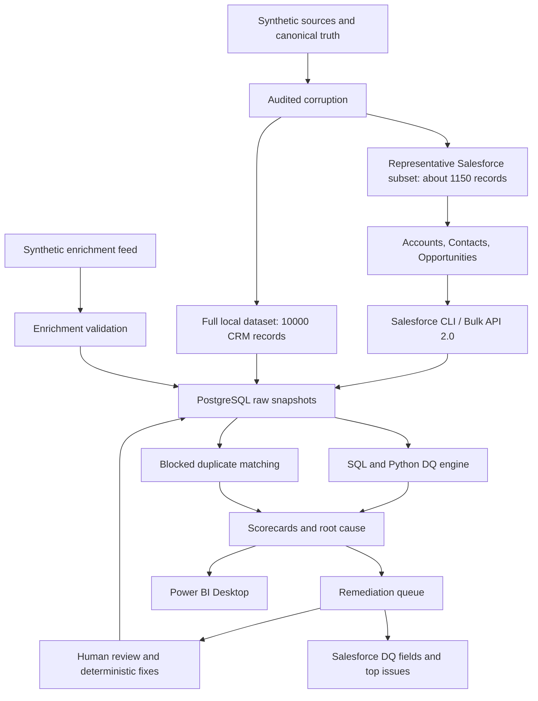

# Architecture and engineering decisions

## Planned end-to-end flow

Milestone 1 implements source generation, metadata, and the database foundation.
Arrows involving import, ingestion, detection, and reporting are subsequent work.

## Identity and lineage

- External IDs (`SYN-A-*`, `SYN-C-*`, `SYN-O-*`) are stable source identities.
- Salesforce assigns its own IDs; they are resolved from external IDs after upsert.
- Source batches describe arrival lineage. Snapshot IDs describe extraction events.
  DQ run IDs describe evaluations. These are three different concepts.
- Raw tables retain `source_kind` through their snapshot: local synthetic records
  have null Salesforce IDs and cannot masquerade as an org export.
- Raw relationships intentionally have no foreign keys to Accounts. Broken links
  are evidence to analyze, rather than rows to reject during ingestion.
- A raw JSON payload accompanies typed projections for investigation and replay.
- Generated canonical truth never goes into the detection engine as an answer key.

## Repeatability and failure behavior

Seed, reference date, business configuration, Faker version and file hashes appear
in each generation manifest. Existing bundles are reused only when every expected
file matches. A changed generation configuration requires a new output directory.
Preserving baselines is more useful than silently replacing them.

Database migrations run under a transaction and advisory lock. An applied migration
is immutable: a changed checksum is an error, not an invitation to patch history.
Add another migration for schema changes.

## Issue identity decision

Use a stable rule/entity identity for the active issue external key and store the
latest run ID separately. The specification's example `run:rule:entity` is unique
within a run but creates a fresh Salesforce issue each run. A stable key better
satisfies its rerun and Developer Edition storage requirements. Run-specific
evidence remains in PostgreSQL, while review decisions survive reruns.

## Money and business policy

PostgreSQL uses NUMERIC for currency. The synthetic scenario assumes a single
reporting currency (USD), including UK and Mexico Accounts. Multi-currency org
support requires an explicit conversion policy in a future milestone.

The eventual prioritization formula is a configurable demo policy, not an industry
standard. Total pipeline exposure must deduplicate Opportunities across all findings.
Missing amounts are unknown exposure and should be counted separately rather than
reported as measured zero revenue.
